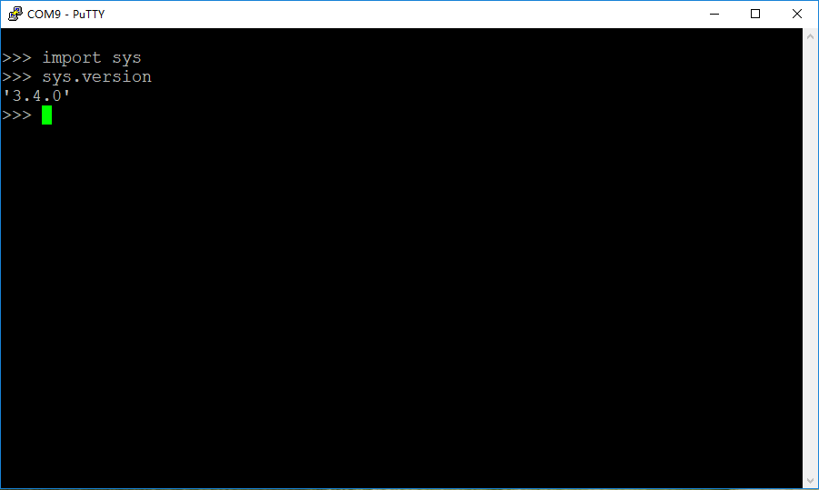
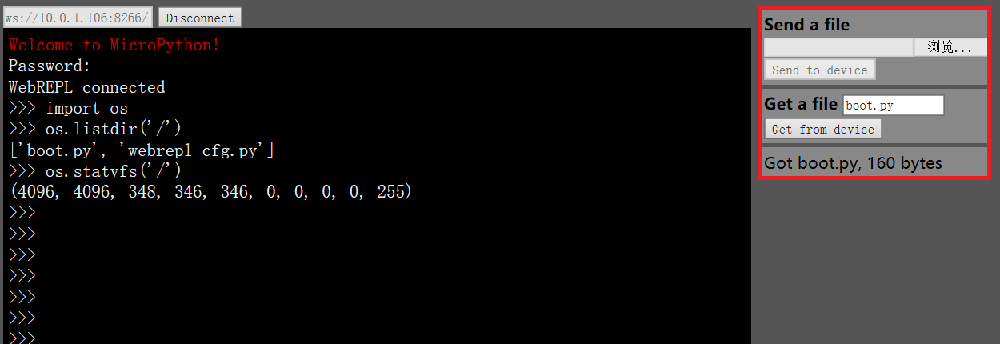

[TOC]
## 简介
本文档主要介绍PiliBoard的基础操作。<br>
在熟悉了基本操作之后，可以进一步深入：<br>
[样例程序](examples/)<br>
[深入MQTT](mqtt_stepbystep/)

## 开发板图示

## 连接开发板
连接开发板，就是进入开发板的REPL环境，即一个符合python语法的交互式命令环境。

有两种方法可以建立与PiliBoard的连接，进入REPL环境。
- WIFI+WebREPL
- 串口+REPL

### WIFI+WebREPL
1. 建立WIFI连接
	- PiliBoard通电后，工作站电脑连接PiliBoard的WIFI AP。
	- 名称为`MicroPython-xxxxxx`，密码为`micropythoN`（注意最后一个`N`为大写）
		
2. WebREPL
	- 访问http://micropython.org/webrepl/
	- 或者下载[webrepl2.html](webrepl2.html)保存在本地，用浏览器打开。
	- 连接：`ws://192.168.4.1:8266/`
	- 初始密码为：`piliboard`
		

注：
1. 当设置了PiliBoard的常规WIFI连接之后，后续就可以不用先将工作站连接到PiliBoard的AP热点上，直接将PiliBoard的IP替换上面的`192.168.4.1`进行WebREPL的连接即可。
2. 如果WebREPL没有打开（开发板上缺省是打开的），这种情况下连接时系统会返回`Disconnected`。这时需要先建立串口连接，然后手工打开WebREPL——参见"网络配置-配置WebREPL"

### 串口+REPL
#### Windows
##### 安装串口驱动程序
下载地址：
http://www.wch.cn/download/CH341SER_ZIP.html
##### 安装putty
下载地址：
https://www.chiark.greenend.org.uk/~sgtatham/putty/latest.html
##### 建立串口连接
- 在命令行窗口输入`mode`，查看PiliBoard连接的串口号。

- 打开putty，连接对应串口，波特率设为115200，Flow control为None


#### MacOS
##### 安装串口驱动程序
下载地址：
http://www.wch.cn/download/CH341SER_MAC_ZIP.html
##### 建立串口连接
- 进入：`screen /dev/ttyUSB0 115200`
- 退出：`ctrl+a` `/`

## 网络操作
PiliBoard的环境中构建了两块逻辑网卡：工作站网卡和AP网卡，各自独立工作。
- 工作站网卡用于连接到无线路由器（此时PiliBoard类似于一台计算机或手机）
- AP网卡让其它WIFI设备将PiliBoard作为热点连接（此时PiliBoard类似于一个无线路由器）
*注：在esp8266上，网络配置后即时生效，重启后不会丢失。*

在配置网络前，运行以下命令，引入对应的网络库：
`import network`

### 工作站网卡配置
首先设置变量`sta_if`为工作站网卡，再进行后续命令。<BR/>
`sta_if = network.WLAN(network.STA_IF)`
#### 连接热点
配置网卡，连接到热点xxxx，密码yyyy
```python
sta_if.active(True)
sta_if.connect('xxxx','yyyy')
```
#### 查询状态命令
- 网卡是否激活：<br>
`sta_if.active()`<br>

- 连接是否成功：<br>
`sta_if.isconnected()`<br>

- 被分配的IP地址与设置：<br>
`sta_if.ifconfig()`<br>

#### 关闭网卡
`sta_if.active(False)`

### AP网卡配置
首先设置变量`ap_if`为AP网卡，再进行后续命令。<br>
`ap_if = network.WLAN(network.AP_IF)`
#### 配置热点
配置热点abcd，密码12345678
```python
ap_if.active(True)
ap_if.config(essid="abcd", password="12345678")
```

#### 网卡相关命令
- 网卡是否激活：<br>
`ap_if.active()`

- 网卡的IP地址：<br>
`ap_if.ifconfig()`

- AP网卡的热点名：<br>
`ap_if.config("essid")`

- 关闭AP网卡：<br>
`ap_if.active(False)`

### 配置WebREPL
可以输入以下命令，进行WebREPL的设置<br>
`import webrepl_setup`


如上图，跟着提示进行相应的输入与配置。

## 文件操作
### 文件操作命令
```python
import os

# 查看文件系统状态
os.statvfs('/')

# 列出当前目录下文件
os.listdir()

# 创建目录
os.mkdir('xxxx')

# 删除目录
os.rmdir('xxxx')

# 列出文件状态
os.stat('test.py')

# 修改文件名
os.rename('test.py','test.py.bak')

# 删除文件
os.remove('test.py.bak')

# 打印文件内容
f=open('boot.py','r')
f.read()
f.close()
```

### WebREPL中文件上传与下载


*注：第二次上传上次上传的文件，需要重新选择文件，否则会上传浏览器缓存的文件。*
## GPIO口
### GPIO输出（控制LED灯）
Piliboard开发板上有一盏连接GPIO 5号口的LED灯，可以用下面命令进行打开和关闭。
```python
import machine
p5 = machine.Pin(5,machine.Pin.OUT)
```

- 开启：<br>
`p5.value(1)`

- 关闭：<br>
`p5.value(0)`

- 查看当前状态：<br>
`p5.value()`

### PWM调制（控制LED灯亮度）
```python
from machine import Pin, PWM

led = PWM(Pin(5))      # 在5号GPIO口上创建一个PWM调值输出
led.freq()             # 获得调制频率
led.freq(1000)         # 设置调制频率
led.duty()             # 获得当前duty（亮度）
led.duty(200)          # 设置duty（亮度）
led.deinit()           # 关闭PWM调制
pwm5 = PWM(Pin(5), freq=500, duty=512) # 在一条命令中创建并设置相关值
```

### GPIO输入
PiliBoard开发板上有一个按钮开关连接GPIO4号口，在非按下状态为高电平，按下后为低电平。
以下程序每秒检测输入值，并打印出结果：
```python
import machine
import time
p4 = machine.Pin(4, machine.Pin.IN)
while True:
    if p4.value():
        print('The button is released')
    else:
        print('The button is pressed')
    time.sleep_ms(1000)
```

注：
- 因为在REPL中会自动缩进，所以以上程序不能直接copy+paste到REPL中。
- 需要先`ctrl+e`进入黏贴模式，然后copy+paste，然后`ctrl+d`退出黏贴模式运行。
- 或者直接手工一行行输入或黏贴，此时缩进会自动出现。
- `ctrl+c`终止程序运行。
- 也可以将以上内容存为一个文件，例如`gpio_input.py`，上传到PiliBoard之后，执行`import gpio_input`执行此文件

### 温湿度传感器
将dht11温湿度传感器，连接到GPIO2号口。
```python
import dht
import machine

d = dht.DHT11(machine.Pin(2))
d.measure()      # 进行测量
d.temperature()  # 温度值，摄氏度
d.humidity()     # 湿度值，%
```

## 一些参考
### ESP8266上MicroPython介绍
http://docs.micropython.org/en/latest/esp8266/esp8266/tutorial/index.html
### MicroPython库介绍
http://docs.micropython.org/en/latest/esp8266/library/index.html
### Piliboard固件中其它内置库
- `Config.py`（json格式配置文件读写、配置内容）
- `ControlApa102.py`(apa102灯带控制程序)
- `IrqLongpressReset.py`(通过按钮调用中断程序)
- `MiniWebSrv.py`（一个小型的Web服务器）
- `SimpleDevice.py`(简单的开关与pwm调值设备)
- `StateMQTTClient.py`（一个基于`umqtt.simple`的mqtt库）

### Piliboard开发板固件初始化状态
- 网络
	- 初始AP网卡为打开，AP的名称为`MicroPython-xxxxxx`，密码为`micropythoN`（注意最后一个`N`为大写）
	- 初始工作站网卡为关闭
- WebREPL
	- 初始自启动WebREPL
    - 连接密码为`piliboard`
    - 可通过命令`import webrepl_setup`进行设置（关闭/开启、密码）

### 固件写入
1. 将开发板上模式开关置于“write flash”状态
2. 按开发板上reset按钮重启PiliBoard
3. 在pc上运行命令：`esptool.py --port COMx erase_flash`，擦除flash中内容
4. 按开发板上reset按钮重启PiliBoard
5. 在pc上运行命令：`esptool.py --port COMx --baud 115200 write_flash 0 firmware-on-pili.bin`，写入固件
6. 将开发板上模式开关置于“run”状态
7. 按开发板上reset按钮重启PiliBoard

注：
- 命令`COMx`为连接的串口，在Windows下可以使用`mode`命令查看，在linux下形式为`/dev/ttyUSB0`
- esptool工具通过`pip3 install esptool`命令安装
- 固件下载地址：https://github.com/zhujisheng/piliboard/raw/master/firmware-on-pili.bin