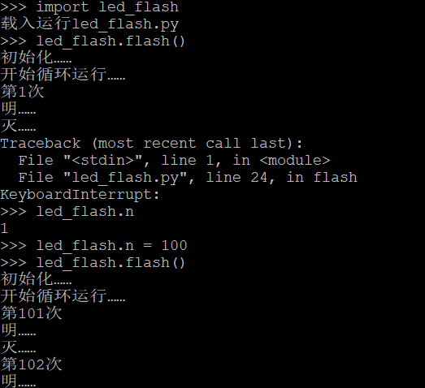
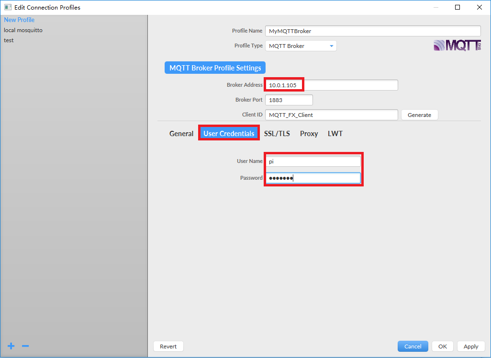

[toc]

### flash.py
- 目的：控制开发板上的led小灯，展现Piliboard上Micropython编程环境的方方面面。
- 程序：[flash.py](flash.py)
		可以看到，Micropython的语法与Python是完全一致的。
- 运行：
	- 在命令行中输入以下命令，运行程序：
`import examples.flash as ledflash`
`ledflash.flash()`

			REPL环境，就是一个python脚本执行的环境，输入是一条条python语句，输出为python程序中打印的内容

	- 按`ctrl+c`中断退出
			一个在运行中的程序，可以通过`ctrl+c`退出
	- 逐条执行以下命令，观察输出
`ledflash.flash()`
`ctrl+c`
`ledflash.n`
`ledflash.n = 100`
`ledflash.flash()`
			随时可以中断程序的运行，随时可以获得和修改运行程序中的变量值


	- 逐条执行以下命令，观察输出
`import examples.flash as ledflash`
`import sys`
`del sys.modules['examples.flash']`
`import examples.flash as ledflash`
`ledflash.flash()`
		系统重新加载一个已经加载的程序，并不会执行任何动作。
        需要先删除sys.modules['程序名']，然后再加载。

	- 输入上下键、tab键

			在REPL环境中，可以通过上下键切换历史输入命令
        	可以随时输入tab，获得命令的提示或补全（当仅有一条可能的命令时，就补全）。

	- 自启动
将以下代码存为`main.py`，上传到根目录。每次piliboard上电启动后即自动运行。
```python
import examples.flash as ledflash
ledflash.flash()
```
			每次系统启动时，会先自动执行boot.py，然后自动执行main.py
        	boot.py一般保存系统级别要初始化的内容，main.py一般保存应用级别要初始化的内容——但这只是习惯，没有严格的要求。

### DHT温湿度传感器
- 目的：演示DHT11传感器值的读取
- 程序：[dht11.py](dht11.py)
- 运行
	- 将DHT传感器三个引脚按照标注，分别接在开发板的3.3v、地、和GPIO2号口
	- 执行命令：
`import examples.dht11 as dht11`
`dht11.measure()`
`dht11.measure()`
- 知识点
	- 在MicroPython中，有现成dht传感器的库可以调用

### 从INTERNET同步时间
- 目的：从INTERNET获得当前的时间
- 程序：[ntp.py](ntp.py)
- 运行
	- 按照基本操作中方法，将开发板连入能上网的WIFI
	- 执行命令：
`import examples.ntp`

### 计时器
- 目的：定时或循环定时执行任务
- 程序：[timer_callback.py](timer_callback.py)
- 运行
	- 执行命令：
`import examples.timer_callback`
	- 停止callback
`examples.timer_callback.tim2.deinit()`
- 知识点
	- 程序即使退出了，定时器还是在走着
	- 定时器要取消，需要调用deinit()函数

### 按钮中断
- 目的：按钮按下或松开时形成中断，调用函数
- 程序：[button_irq.py](button_irq.py)
- 运行
	- 执行命令：
`import examples.button_irq`
	- 重复按下和松开开发板上的按钮（GPIO4），观察输出
	- 停止按钮callback
`examples.button_irq.button.irq(handler=None)`
- 知识点
	- 程序即使退出了，设置的中断还是在起作用
	- 中断要取消，重新设置中断，将处理函数设为None

### 深度睡眠
- 目的：进入深度睡眠，在一定时候之后重新启动
- 程序：[deepsleep.py](deepsleep.py)
- 运行
	- 将开发板上的sleep awake开关置于enable模式
	- 执行命令：
`import examples.deepsleep`
	- 10秒之后，自动启动，执行以下命令

```python
import machine
if machine.reset_cause() == machine.DEEPSLEEP_RESET:
    print('从deep sleep启动')
elif machine.reset_cause() == machine.HARD_RESET:
    print('硬重启')
elif machine.reset_cause() == machine.SOFT_RESET:
    print('软重启')
elif machine.reset_cause() == machine.WDT_RESET:
    print('从看门狗重启')
elif machine.reset_cause() == machine.PWRON_RESET:
    print('上电启动')
else:
    print('未知启动原因')
```
- 知识点
	- 深度睡眠之后的重启，整个系统完全重启
	- 可以从machine.reset_cause()获得启动原因

### WEB服务
- 目的：socket编程，构建一个简单的web服务页面
- 程序：[httpserver.py](httpserver.py)
- 运行
	- 执行命令：
`import examples.httpserver`
	- 浏览器，访问http://piliboard_ip/
	- 将piliboard上的按钮（GPIO4）按下，刷新网页，观察内容变化

### WEB客户端
- 目的：socket编程，构建一个简单的web客户端
- 程序：[httpclient.py](httpclient.py)
- 运行
	- 执行命令：
`import examples.httpclient`
	- 观察输出

### MQTT控制
- 目的：通过MQTT协议，控制piliboard开发板上的led灯
- 程序：[mqtt_control.py](mqtt_control.py)
- 运行
	- 执行命令：
`import examples.mqtt_control as mqtt_control`
`mqtt_control.main(mqtt_broker='test.mosquitto.org',command_topic='my/test/topic')`
	- 如果你有自己的mqtt服务器，可以运行以下命令：
`import mqtt_control as mqtt_control`
`mqtt_control.main(mqtt_broker='10.0.1.105',mqtt_port=1883,mqtt_user="pi",mqtt_password="hachina",command_topic='my/test/topic')`
此处，将`10.0.1.105`替换为您的MQTT服务器，`pi`替换为您MQTT服务上的用户名，`hachina`替换为您的密码。
	- 控制
		- 使用mosquitto_pub命令控制
开灯：
`mosquitto_pub -h test.mosquitto.org -t "my/test/topic" -m "ON"`
关灯：
`mosquitto_pub -h test.mosquitto.org -t "my/test/topic" -m "OFF"`

		- 使用MQTTFX客户端控制
设置到mqtt服务器的连接：

发布开灯（关灯）命令：


		- 使用HomeAssistant控制
```yaml
# MQTT服务器信息配置
mqtt:
  broker: test.mosquitto.org
light:
  # MQTT灯
  - platform: mqtt
    name: "Demo light over MQTT"
    command_topic: "my/test/topic"
```


### 灯带控制
- 目的：控制灯带，按红绿蓝白间隔显示
- 程序：[apa102.py](apa102.py)
- 运行
	- 执行命令：
`import examples.apa102`


